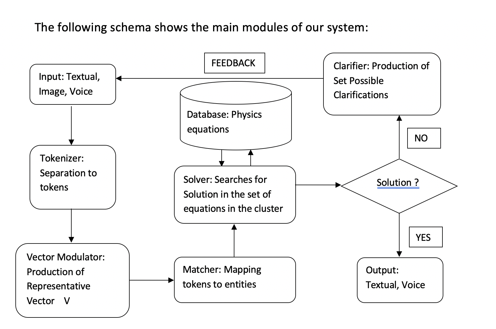

# Physics Solver: From Cognition to Education
Solving problems is one of the core abilities of the human brain. Based on a set of data the brain computes a solution and stores the path followed in the process for future use. The goals of this research project are to: develop a program that follows a similar process to solve Physics problems and to present the solution in such a way so that students can focus more on the ideas, rather than the underlying mathematical calculations.

First, the input module of the program receives the statement of a physics problem in a textual, image, or voice form and processes it separating the relevant data into tokens. Then the solver module searches through a set of formulas stored in a database depending on the given data and the requested calculation. It performs an in-depth search, combining different formulas in order to yield the result. If none of the formulas stored in the database are compatible, the system can derive new formulas by transforming the existing ones. Finally the system outputs the solution as well as the steps followed.

By focusing on the ideas in physics rather than the math, this project aims to help the efforts made by education communities to support every student and teacher in the learning process. Especially those who face major problems like lack of teachers that can provide personalized guidance and support or lack of resources like tools, books etc. This program can also help students with special needs as a valuable learning companion.

Authors: Dimitrios Kriezis, Athanasios Taprantzis
